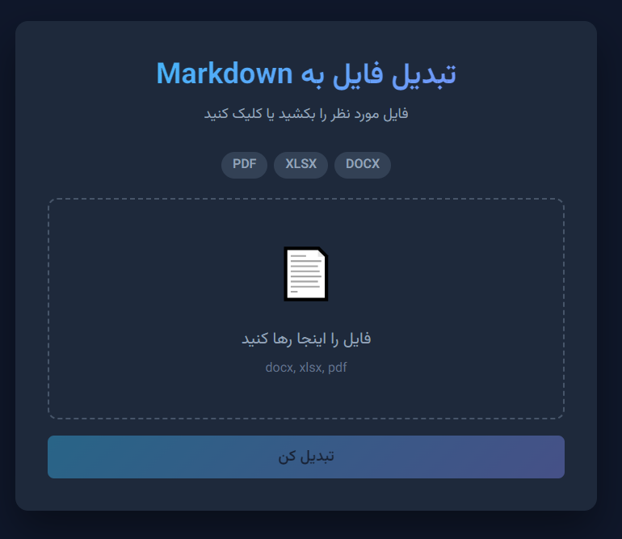

<div dir="rtl">

# file2md

**تبدیل سریع و آسان فایل‌های Word، Excel و PDF به Markdown**

[](https://python.org)
[](#)

---



---

## ✨ امکانات

| فرمت | پشتیبانی | جزئیات |
|------|----------|--------|
| `.docx` | ✅ | عنوان‌ها، لیست‌ها، بولد، ایتالیک، زیرخط |
| `.xlsx` | ✅ | جدول‌ها، انتخاب شیت |
| `.pdf` | ✅ | استخراج متن |

- 🎨 رابط کاربری مدرن با RTL کامل
- 🌐 فونت **Vazirmatn** برای نمایش صحیح فارسی
- 📋 کپی سریع خروجی با یک کلیک
- 💾 دانلود فایل `.md` با نام دلخواه
- 🔄 Drag & Drop
- 📱 ریسپانسیو
- ⚡ پردازش کامل در مرورگر (بدون آپلود سرور)

---

## 🚀 شروع سریع

### رابط وب

```bash
# ویندوز
start markd/index.html

# مک
open markd/index.html
```

### خط فرمان (Python)

```bash
python docx2md.py input.docx
python docx2md.py data.xlsx output.md
python docx2md.py document.pdf
```

---

## 📦 نصب

### رابط وب
نیازی به نصب نیست! فایل `index.html` را باز کنید.

### CLI (Python)

```bash
pip install pdfminer.six   # اختیاری، برای PDF
```

---

## 📖 نحوه استفاده

### رابط وب

1. فایل را بکشید یا کلیک کنید
2. نام فایل خروجی را وارد کنید
3. روی **تبدیل کن** کلیک کنید
4. **دانلود** یا **کپی** کنید

---

## 📁 ساختار پروژه

```
markd/
├── index.html      # رابط وب
├── docx2md.py      # خط فرمان
├── screenshot.png
└── README.md
```

---

## 📄 مجوز

MIT License

</div>
